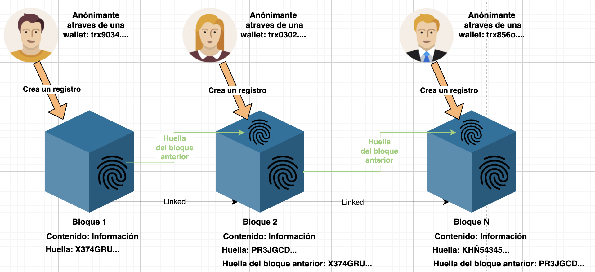

# Módulo 1: Introducción a Blockchain

## ¿La revolución de Bitcoin?

El 2017 fue un año muy importante para las criptomonedas. Se había creado un nuevo valor, una nueva moneda que estaba alojada en algo llamado [blockchain][Blockchain wiki ES]. Las personas no comprendian conceptos como blockchain o criptomonedas pero sí soaring prices o precios en alza.

[Bitcoin][Bitcoin wiki ES] comenzó en el 2017 con un valor de 900 USD y tuvo un crecimiento de 2000% en 12 meses. Luego de este gran crecimiento llego el desplome del mercado y esto generó que haya una gran perdida de interés.

Esto puede compararse con [la búrbuja dot-com][Búrbuja dot-com wiki ES] y esto llevo a preguntarse [¿búrbujas crypto?][Búrbuja cripto wiki ES].

En la era moderna el [ciclo de sobreexpectación][Hype cycle wiki ES] se ha visto en varias oportunidades a lo largo de la historia generando que muchas personas quieran subirse a ese hype.

Consideremos que bitcoin comenzo con un boceto en papel, sin compañias ni corporaciones, solo un grupo de personas que escribieron código y ejecutaban programas en una computadora y consiguieron crear una nueva moneda en menos de una década obteniendo valor de cientos de miles de dólares, ¿cuando en la historia de nuestro planeta hemos visto algo igual?

No hay gobiernos, ni bancos que puedan control o manejarla. Esto emerge de un conjunto de acuerdos y prótocolos para desparramar el ownership del sistema entre los participantes.

Esto definitivamente fue increible y algo revolucionante y la tecnologia detras de esto es blockchain.

## Un poco acerca de Consensys y este curso

[Consensys][Consensys wiki EN] es el líder mundial en tecnología blockchain con foco especialmente en [Ethereum][Ethereum wiki ES].

Este curso está enfocado en enseñar las bases y lo básico sobre blockchain.

## Una blockchain de papel

Blockchain es un conjunto de bloques de información conectados linealmente y protegidos mediante [criptografía][Criptografía wiki ES].

A medida que se añaden nuevos bloques, los anteriores son más dificiles de modificar, por lo que son más seguros.

Los nodos, son las computadoras que ejecutan software blockchain, son los "contadores".

Un [nodo][Nodo wiki ES] toma y comprueba transmiciones de transacciones a la red e intenta colocarlos a todos juntos dentro de un bloque, en una competencia contra otros nodos.

## ¿Porqué blockchain es excitante?

- El valor del contenido digital.
- Mantener seguridad y la verdad.
- Desentralización. 
- Web3.

## La breve historia de blockchain

| Año   | Blockchain                                                                                              | Bitcoin                                                | Ethereum                                                                     |
|-------|-----------------------------------------------------------------------------------------------------|--------------------------------------------------------|------------------------------------------------------------------------------|
| 1991  | [Stuart Haber][Stuart Haber wiki EN] y [Scott Stornetta][Scott Stornetta wiki EN] trabajan en la primera cadena de bloques                               | NA                                                     | NA                                                                           |
| 1992  | [Árboles de Merkle][Árboles de Merkle wiki ES] formaron una corporación legal utilizando un sistema desarrollado por Stuart Haber y W. Scott Stornetta | NA                                                     | NA                                                                           |
| 2000  | [Stefan Konst][Konst site GE] publicó su [teoría de cadenas seguras criptográficamente][Teoría de cadenas seguras criptográficamente GE]                                  | NA                                                     | NA                                                                           |
| 2004  | El activista criptográfico [Hal Finney][Hal Finney wiki ES] introdujo el ["Proof of Work" reutilizable][Proof of Work reutilizable EN]                       | NA                                                     | NA                                                                           |
| 2008  | "Satoshi Nakamoto" conceptualizó el concepto de "Cadena de bloques distribuida" en su whitepaper: ["Un sistema de efectivo electrónico entre pares"][Satoshi - Un sistema de efectivo electrónico entre pares EN] | NA                                                     | NA                                                                           |
| 2009  | James Howells, un trabajador de IT en el Reino Unido, comienza a minar Bitcoin. Satoshi Nakamoto publica el [Whitepaper de Bitcoin][Whitepaper Bitcoin ES] | NA                                                     | NA                                                                           |
| 2014  | Nace [Blockchain 2.0][Blockchain 2.0 sciencedirect EN]                                                                                  | NA                                                     | La blockchain de [Ethereum][ethereu.org] es financiada por una venta de tokens        |
| 2015  | [La Fundación Linux][The Linux fundation] lanzó [el proyecto Hyperledger][el proyecto Hyperledger]                                                     | NA                                                     | Se lanzó la red [Ethereum Frontier][Frontier network EN]                                             |
| 2016  | Blockchain se acepta como una sola palabra en lugar de dos conceptos diferentes                      | El intercambio de bitcoins Bitfinex fue hackeado, resultando en el robo de 120,000 bitcoins | NA                                                                           |
| 2017  | La compañía Block.one introdujo el sistema operativo de [blockchain EOS][EOS EN]                         | [Japón reconoció Bitcoin como una moneda legal][Japón legaliza Bitcoin criptonoticias ES]         | NA                                                                           |
| 2018  | Google, Twitter y Facebook prohibieron la publicidad de criptomonedas                                 | Bitcoin cumplió 10 años en 2018                       | NA                                                                           |
| 2019  | NA                                                                                                  | NA                                                     | Las transacciones de la red Ethereum superaron el millón por día              |
| 2020  | Los Stablecoins experimentaron un aumento                                                             | NA                                                     | Ethereum lanzó [Beacon Chain][Beacon Chain EN] en preparación para Ethereum 2.0                  |
| 2022  | NA                                                                                                  | NA                                                     | [Ethereum Merge][Ethereum merge EN]. El mecanismo de consenso de Ethereum ahora es [Proof of Stake][Proof of Stake wiki EN] (PoS) |

[Bitcoin wiki ES]: https://es.wikipedia.org/wiki/Historia_de_bitcoin
[Blockchain wiki ES]: https://es.wikipedia.org/wiki/Cadena_de_bloques
[Búrbuja dot-com wiki ES]: https://es.wikipedia.org/wiki/Burbuja_puntocom
[Hype cycle wiki ES]: https://es.wikipedia.org/wiki/Ciclo_de_sobreexpectaci%C3%B3n
[Búrbuja cripto wiki ES]: https://es.wikipedia.org/wiki/Burbuja_de_las_criptomonedas
[Consensys wiki EN]: https://en.wikipedia.org/wiki/Consensys
[Ethereum wiki ES]: https://es.wikipedia.org/wiki/Ethereum
[Criptografía wiki ES]: https://es.wikipedia.org/wiki/Criptograf%C3%ADa
[Nodo wiki ES]: https://es.wikipedia.org/wiki/Nodo_(inform%C3%A1tica)
[Konst site GE]: http://www.konst.de/
[Teoría de cadenas seguras criptográficamente GE]: http://www.konst.de/stefan/seclog.pdf
[Árboles de Merkle wiki ES]: https://es.wikipedia.org/wiki/%C3%81rbol_de_Merkle
[Proof of Work reutilizable EN]: https://nakamotoinstitute.org/finney/rpow/index.html
[Hal Finney wiki ES]: https://es.wikipedia.org/wiki/Hal_Finney
[Stuart Haber wiki EN]: https://en.wikipedia.org/wiki/Stuart_Haber
[Scott Stornetta wiki EN]: https://en.wikipedia.org/wiki/W._Scott_Stornetta
[Satoshi - Un sistema de efectivo electrónico entre pares EN]: https://bitcoin.org/bitcoin.pdf
[Whitepaper Bitcoin ES]: https://bitcoin.org/files/bitcoin-paper/bitcoin_es_latam.pdf
[Blockchain 2.0 sciencedirect EN]: https://www.sciencedirect.com/science/article/abs/pii/S006524582030070X
[el proyecto Hyperledger]: https://www.hyperledger.org/about
[The Linux fundation]: https://www.linuxfoundation.org/
[ethereu.org]: https://ethereum.org/es/what-is-ethereum/
[Frontier network EN]: https://ethereum.org/es/history/#frontier-thawing
[EOS EN]: https://eosnetwork.com/about-us/
[Japón legaliza Bitcoin criptonoticias ES]: https://www.criptonoticias.com/comunidad/adopcion/japon-legaliza-bitcoin-metodo-pago/
[Beacon Chain EN]: https://wiki.rugdoc.io/es/docs/what-is-the-beacon-chain/
[Ethereum merge EN]: https://ethereum.org/es/roadmap/merge/
[Proof of Stake wiki EN]: https://en.wikipedia.org/wiki/Proof_of_stake